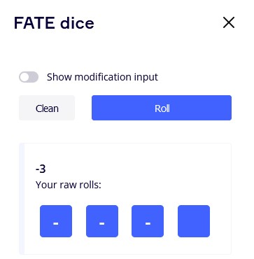
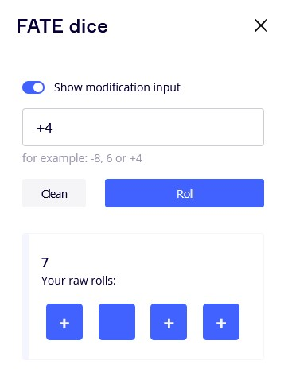
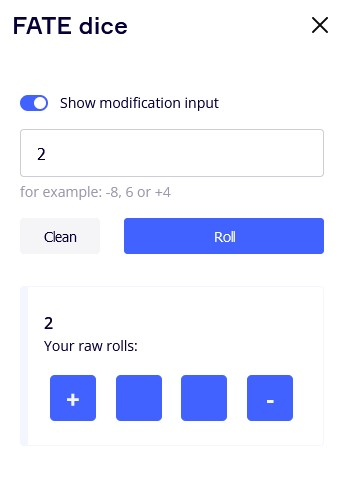
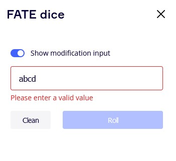

## Fate Dices
##### License info for Fate: ```https://www.faterpg.com/licensing/?from=fate-srd``` and my "license.txt" file

### About this app
This app is a simple Miro extension for private rolling Fate dices. \
You could roll Fate dices with or without a modification value.

Built using [`create-miro-app`](https://www.npmjs.com/package/create-miro-app). \
This app uses [Vite](https://vitejs.dev/).

##### App screens

 \
 \
 \



### How to start locally
- Run `yarn install` to install dependencies.
- Run `yarn start` to start developing. \
  Your URL should be similar to this example: `http://localhost:3000`
- Paste the URL under **App URL** in your [app settings]in Miro
- Open a board; you should see your app in the app toolbar or in the **Apps** panel.

### How to build the app
- Run `yarn build`. \
  This generates a static output inside [`dist/`](./dist), which you can host on a static hosting service.
